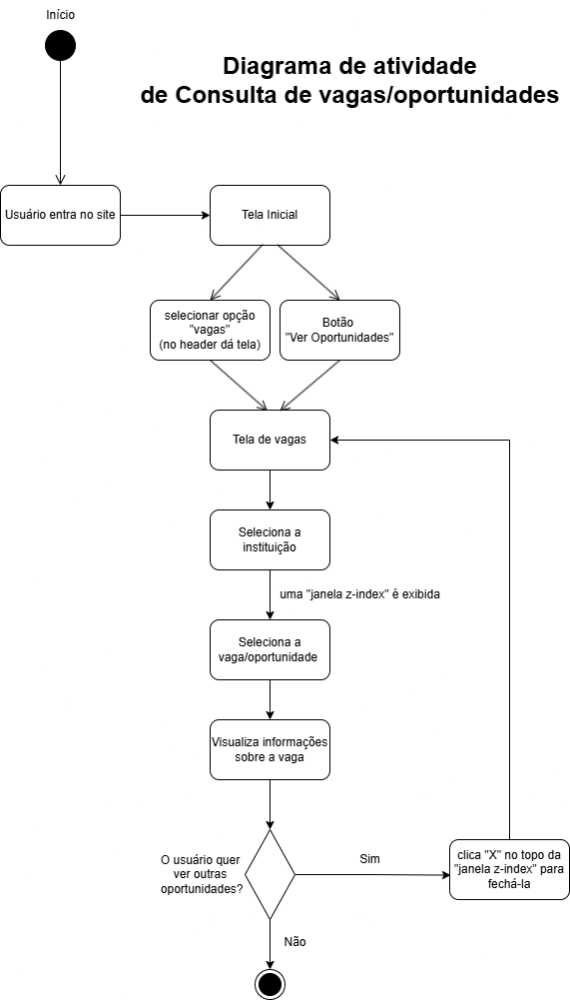
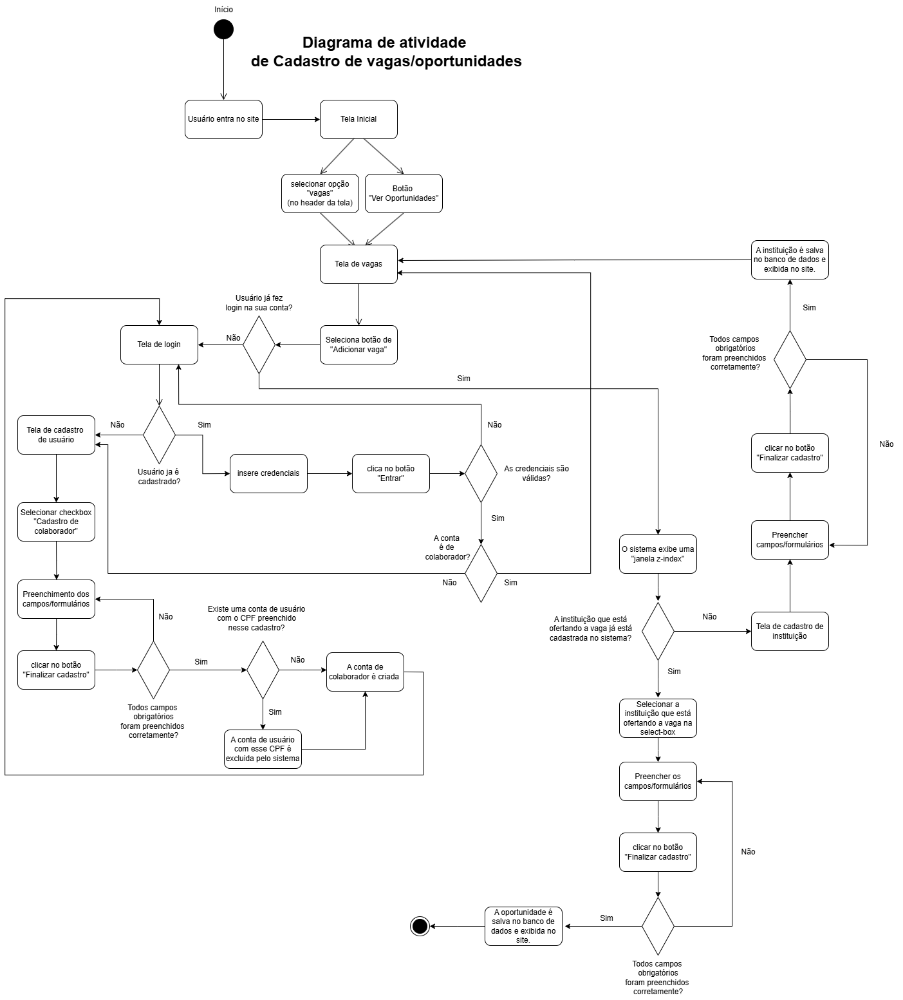
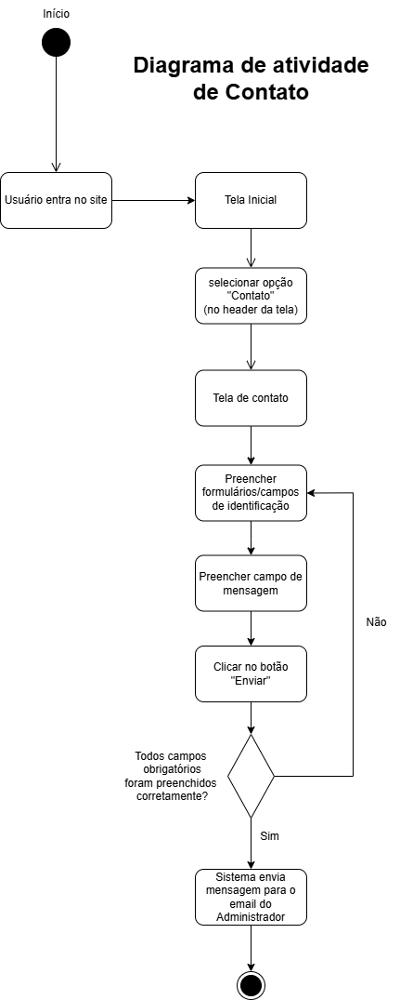
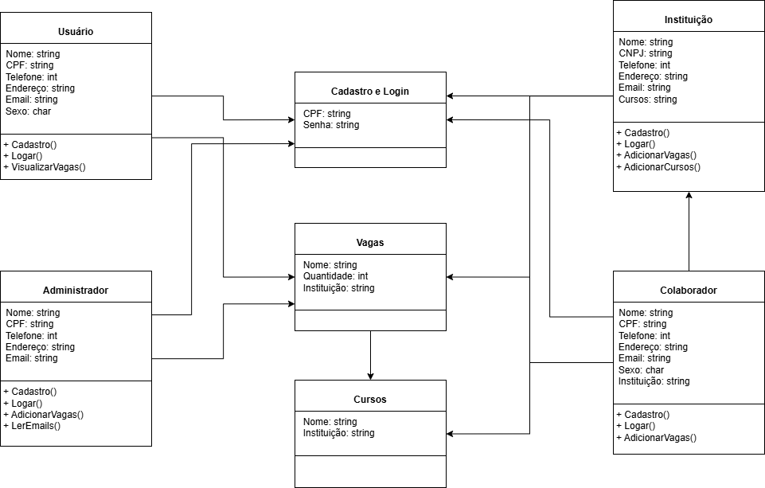

# EstudAqui

## Licença:
-> No presente projeto, estamos utilizando a licença GPLv3(GNU General Public Licence).

````
EstudAqui
Copyright (C) 2025  Marcello Vinhais, Lucas Gabriel, Ryan Clayton.

Este programa é software livre; você pode redistribuí-lo e/ou
modificá-lo sob os termos da Licença Pública Geral GNU, conforme
publicada pela Free Software Foundation; seja a versão 3 da Licença,
ou (a seu critério) qualquer versão posterior.

Este programa é distribuído na esperança de que seja útil,
mas SEM QUALQUER GARANTIA; sem mesmo a garantia implícita de
COMERCIABILIDADE ou ADEQUAÇÃO A UM PROPÓSITO ESPECÍFICO. Consulte a
Licença Pública Geral GNU para obter mais detalhes.

Você deve ter recebido uma cópia da Licença Pública Geral GNU
junto com este programa. Se não, veja <https://www.gnu.org/licenses/>.

````

## Introdução
-> Um projeto EstudAqui criado à partir da matéria "Projeto Integrador Extensionista III" que visa reunir oportunidades educacionais e profissionalizantes em um só lugar, com a contribuição da sociedade para atualizar o sistema com as mesmas. Em suma, um **projeto que visa criar um portal de vagas educacionais e profissionalizantes.**

## Documentação:

### Diagramas:

#### Diagrana de Atividade:

##### Consulta de vagas:



##### Cadastro de Vagas/Oportunidades



##### Login:


##### Contato:



---

#### Diagrama de Classes:




#### Diagrama de Caso de Uso:
